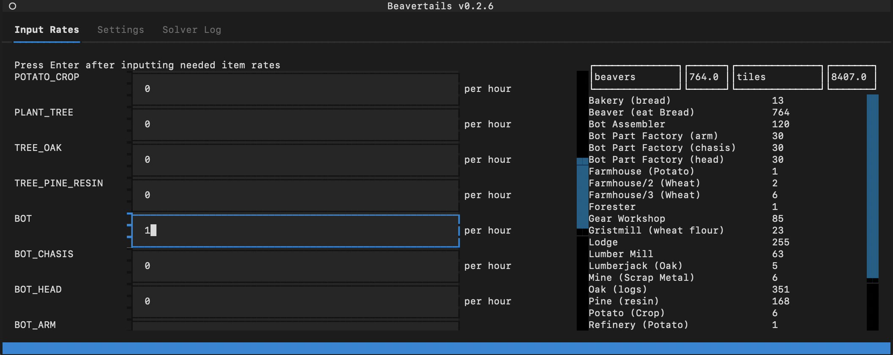

# B.E.A.V.E.R.T.A.I.L.S.

(**B**eaver
**E**ngineering
**A**nd
**V**illage
**E**xpansion
**R**esource
**T**ransport
**A**llocation
**I**nteger
**L**inear
**S**ystems)

An unofficial, unaffiliated, third-party resource planning assistant for [Mechanistry](https://mechanistry.com/)'s *Timberborn* video game.


*beavertails 0.2.6 on macOS*

## Binary Releases

Prebuilt binaries are available on the [releases](https://github.com/cwpearson/beavertails/releases) page for
* macOS 11
* Ubuntu 20.04
* Windows 2019

If you are using an older operating system the binary releases may not work and you'll need to download the source and run it yourself.

### Using the binary release on Windows

1. Download the `beavertails_win2019.zip` from the releases page and extract.
2. Double-click
3. A warning along the lines of insecure app will pop up. That's because I don't know (or care) how to sign a Windows app.
4. Click through the warning and the app will run in a terminal window.

### Using the binary release on macOS

1. Download the `beavertails_macOS.zip` from the releases page and extract.
2. Right-click on `beavertails` and click `Open`
3. A warning about "a Unix app downloaded from the Internet" will pop up. That's because I don't care to create an Apple developer account and sign the binary.
4. Click through the warning and the app will run in a terminal window.

### Using the binary release on Ubuntu

1. Download the `beavertails_ubu2004.zip` from the releases page and extract.
2. Navigate to the extracted file in your terminal and run it.

## Running from Source

Clone the repository

```
pip install -r requirements.txt
python -m beavertails.tui
```

## Acknowledgements

* Built using [textualize/textual](https://github.com/Textualize/textual)
* Built using [coin-or/pulp](https://github.com/coin-or/pulp)

## Building for macOS

```bash
pyinstaller beavertails/tui.py \
  --add-data beavertails/static:./beavertails/static \
  --add-data beavertails/beavertails.tcss:. \
  --collect-all pulp \
  --onefile \
  --name beavertails_macOS
```

## Building for Ubuntu

```bash
pyinstaller beavertails/tui.py \
  --add-data beavertails/static:./beavertails/static \
  --add-data beavertails/beavertails.tcss:. \
  --collect-all pulp \
  --onefile --nowindow --noconfirm \
  --name beavertails_ubu2004
```

## Building for Windows

```bat
pyinstaller beavertails/tui.py --add-data "beavertails/static;./beavertails/static" --add-data "beavertails/beavertails.tcss;." --collect-all pulp --onefile --nowindow --noconfirm --name beavertails_win2019.exe
```

## Roadmap

- [x] TUI using textual
- [x] include recipe utilization in the model
- [x] configurable workday length
- [x] configurable other parameters
- [x] Beavers eat multiple foods
- [x] global efficiency
  - [ ] individual recipe efficiencies
- [ ] enable/disable recipes
- [ ] injuries
- [ ] well-being
- [ ] use `.spec` for pyInstaller

